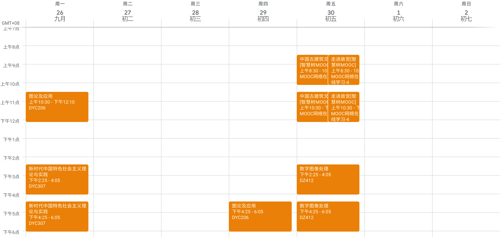

# 重庆大学研究生课程表导出工具

该项目可以从重庆大学 MIS 系统中导出研究生课表并生成通用的 ICS 日历文件，利用该文件可以将课程表导入手机、电脑的系统日历中，也可以将其导入 Outlook、Google Calendar 等大部分日程管理工具中。以下是导入 Google Calendar 的示例：


### 快速开始
克隆项目到本地
```bash
https://github.com/haowang-cqu/cqu-graduate-curricula.git
```
编辑 `main.py` 文件中的以下内容
```python
USER_ID = ""                 # 学号
PASSWORD = ""                # 密码
TERM = 2                     # 学期 1 或者 2
START_TIME = "2023-02-13"    # 第一周周一的日期
```
运行 `main.py` 即可得到名为 `curricula.ics` 的日历文件
```bash
python main.py
```
将日历文件导入您使用的软件中
